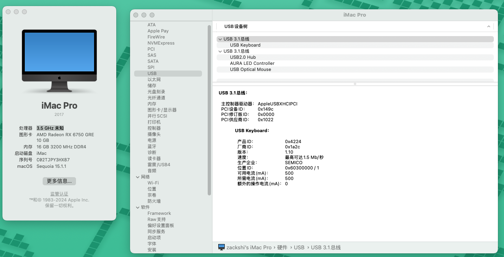
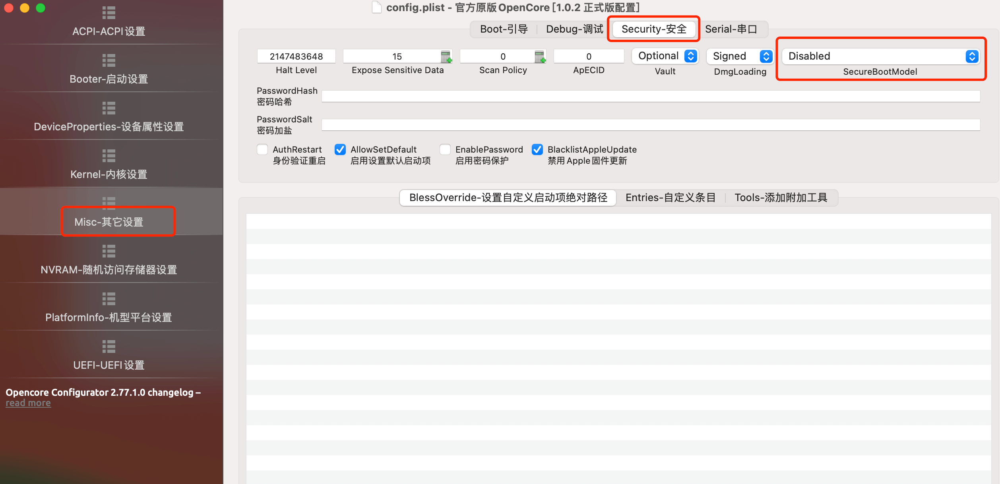

# RYZENTOSH-5600-550M-RX6750GRE

> https://drama-blog.vercel.app/posts/hackintosh

[👍 RX 6750GRE 显卡看这里👀](https://github.com/goozyshi/RYZENTOSH-5600-550M-RX6600-6750GRE/tree/6750gre)

👏 **AMD YES** ‼️

基于 OpenCore 1.0.3 的 Ryzen 5600 + Asus B550M-plus + RX6750GRE 10G 安装的黑苹果。系统感觉比之前更丝滑了。

主要用来敲代码，刚需功能已完善，欢迎 star 完善。

## 💻 设备信息

 

 

 

| **设备**     | **型号**                                                                                                                                                                              |
| ------------ | ------------------------------------------------------------------------------------------------------------------------------------------------------------------------------------- |
| **CPU**      | 3,5 GHz AMD Ryzen 5 5600 6-Core Processor                                                                                                                                             |
| **显卡**     | [XFX RX 6750 GRE 10GB](http://www.xfx.com.cn/graphic_cards/rx-6750gre-10gb-%E9%9B%AA%E7%8B%BC/)                                                                                                                                                         |
| **内存**     | 16GB KingBank DDR4 2666MHZ                                                                                                                                                            |
| **主板**     | [ASUS TUF GAMING B550M-PLUS](https://www.asus.com.cn/motherboards-components/motherboards/tuf-gaming/tuf-gaming-b550m-plus/)                                                          |
| **SSD**      | ZHITAI Ti600 1TB                                                                                                                                                                      |  |
| **Ethernet** | Realtek RTL8125 2.5GbE Controller （主板自带）                                                                                                                                        |
| **Audio**    | Realtek ALCS1200A (**layout-id=11**， 其他型需要更改layout-id或者 启动项的 alcid，可以查询[AppleALC-Supported codecs](https://github.com/acidanthera/applealc/wiki/supported-codecs)) |

## ✅ 功能

-  CPU power management
-  Graphics acceleration
-  Ethernet
-  Keyboard & Mouse
-  USB ports
-  HDMI video & audio output.
-  iCloud & App Store & iMessage

## ❌ 问题

跟之前一样，找个音频线解决声音播放的问题。

## 🎉一些优化

### 安装 wifi 蓝牙驱动
- 首先需要[**定制USB**](https://apple.sqlsec.com/6-%E5%AE%9E%E7%94%A8%E5%A7%BF%E5%8A%BF/6-1.html)，建议 Windows 下定制端口生成 [UTBMap.kext](https://github.com/USBToolBox/tool) + [USBToolBox.kext](https://github.com/USBToolBox/kext) 进行定制，MacOS 下则可以选择 [USBMAP](https://github.com/corpnewt/USBMap) 进行定制，最终生成 **USBMAP.kext** 文件。
- 生成的xxmapkext 最后要和 ACPI 的 SSDT-EC-USBX-DESKTOP 一起勾选 Enable 使用
- USB端口定制后，USB下面会显示BCM的设备名称
- 安装博通蓝牙驱动 [BrcmPatchRAM](https://github.com/acidanthera/BrcmPatchRAM):
  - BlueToolFixup.kext （BigSur 及之前使用 BrcmBluetoothInjector.kext）
  - BrcmFirmwareData
  - BrcmPatchRAM3.kext （10.13 使用）
- 安装 Intel 蓝牙如 AX210，使用 [IntelBluetoothFirmware](https://github.com/OpenIntelWireless/IntelBluetoothFirmware)
  - BlueToolFixup.kext
  - IntelBluetoothFirmware.kext
  - IntelBTPatcher.kext
-  安装蓝牙后，隔空投送则使用 [AirportBrcmFixup](https://github.com/acidanthera/AirportBrcmFixup) 或者 [AirportItlwm](https://github.com/OpenIntelWireless/itlwm)，后者是[z大](https://github.com/zxystd)用于解决intel网卡的。

### 性能监控

- CPU 监控：[AMD POWER GADGET App](https://github.com/trulyspinach/SMCAMDProcessor) ⚠️ 需要**搭配 SMCAMDProcessor.kext** 使用
- GPU 监控：[RadeonSensor](https://github.com/aluveitie/RadeonSensor)
- 显示器亮度调节 🔅：[MonitorControl App](https://github.com/MonitorControl/MonitorControl)

## 安装过程可能遇到的问题

### 1.安装 Sequoia 系统后最后一步卡 mac installer 无限重启

**解决方案**： 使用编辑器打开config.plist文件设置

【Misc】-【Security】-【SecureBootModel-Disabled】

### 2.安装完 Sequoia 系统进入系统后黑屏，屏幕提示无信号

Navi 2x 系从 macOS Big Sur 开始支持 RX6000，到现在 macOS Sonoma 也就是 RX6600XT，RX6800，RX6800XT，RX6900XT 这几个型号，因为驱动相同的关系，也支持 W6600 和 W6800，同时通过仿冒设备 ID，RX6650XT，RX6950XT 也可以支持。但是中高端序列的 RX6700 全系列都不被支持。

**解决方案**： 显卡无驱动，将 NootRX.kext 放到 EFI/OC/Kexts 目录，并在 config.plist 文件中启用。

**‼️注意该驱动和 WhateverGreen.kext 冲突**，需要取消。

ps： 现在无需再显卡仿冒，感谢 Noot 团队的 [@NootRx](https://github.com/ChefKissInc/NootRX) 项目，RX6700、RX6700XT、RX6700XL（XFX 矿卡特供）、RX6750XT、RX6750GRE（中国市场特供）已经可以在 macOS 正常驱动。

## 单硬盘双系统

将 Microsoft 放入 OC 中，并在 MISC 设置启动项绝对路径：`\EFI\OC\Microsoft\Boot\bootmgfw.efi`

## 致谢

- 国内OCC下载：[opencore configurator](https://macoshome.com/hackintosh/htools/2100.html)
- 镜像来源：[悦享社区](https://yuexiang.fun/2425.html)
- 教程入门：[国光的黑苹果安装教程：手把手教你配置 OpenCore](https://github.com/sqlsec/Hackintosh/tree/main)
